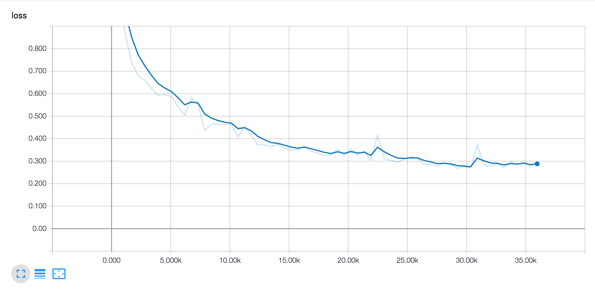
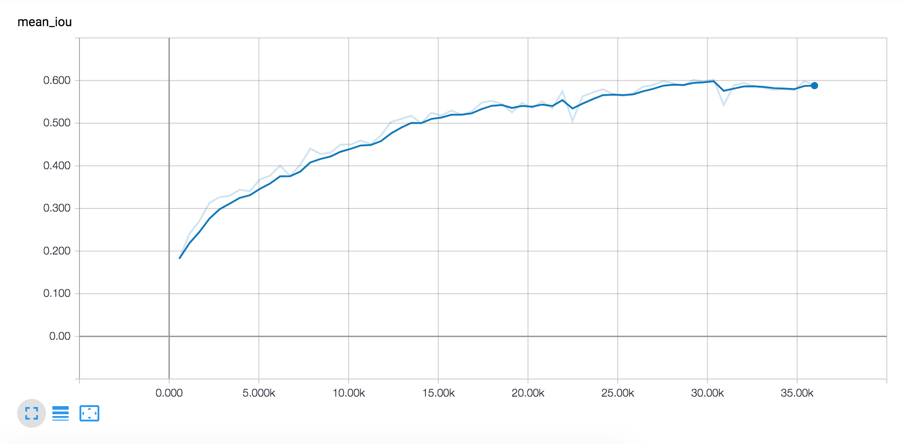
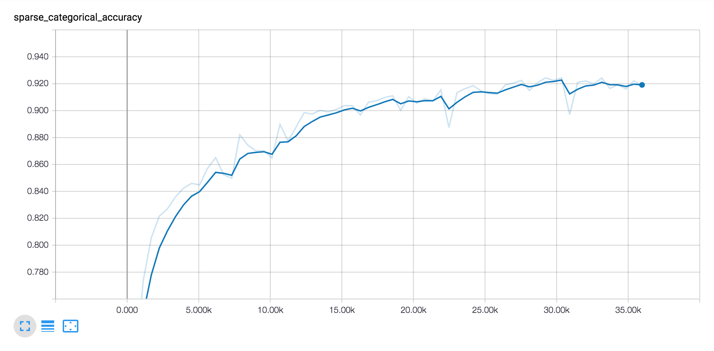
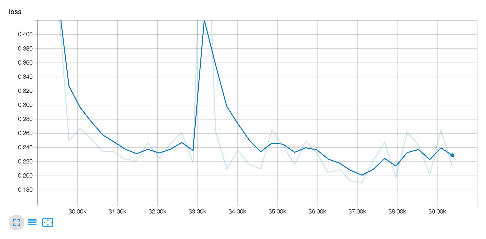
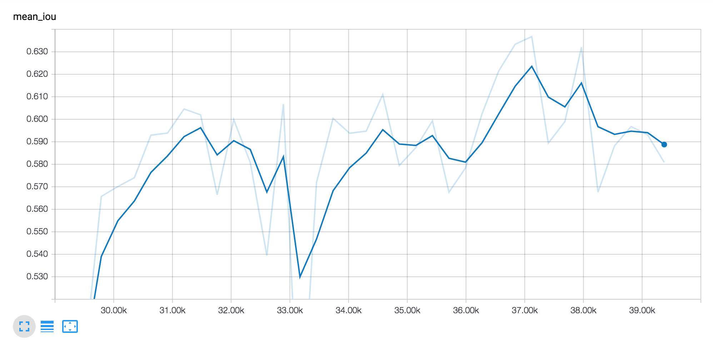
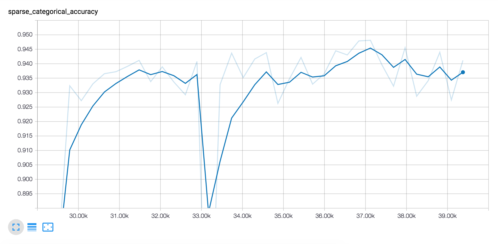

# Keras Fully Connected DenseNet

This is a Keras implementation of the [Fully Convolutional DenseNets for Semantic Segmentation](https://arxiv.org/abs/1611.09326) paper.
The model is trained on the [CamVid](http://mi.eng.cam.ac.uk/research/projects/VideoRec/CamVid/) dataset. 

## Introduction

Fully Convolutional Networks (FCNs) are a natural extension of CNNs to tackle per pixel prediction problems such as semantic image
segmentation. FCNs add upsampling layers to standard CNNs to recover the spatial resolution of the input at the output layer. In 
order to compensate for the resolution loss induced by pooling layers, FCNs introduce skip connections between their downsampling 
and upsampling paths. Skip connections help the upsampling path recover fine-grained information from the downsampling layers.

One evolution of CNNs are [Residual Networks](https://arxiv.org/abs/1512.03385) (ResNets). ResNets are designed to ease the training of 
very deep networks by introducing a residual block that sums the non-linear transformation of the input and its identity mapping. 
The identity mapping is implemented by means of a shortcut connection. ResNets can be extended to work as FCNs. ResNets incorporate 
shortcut paths to FCNs and increase the number of connections within a network. This additional shortcut paths improve the segmentation 
accuracy and also help the network to converge faster.

Recently another CNN architecture called [DenseNet](https://arxiv.org/abs/1608.06993) has been introduced. DenseNets are built from 
*dense blocks* and pooling operations, where each dense block is an iterative concatenation of previous feature maps. This architecture 
can be seen as an extension of ResNets, which performs iterative summation of previous feature maps. The result of this modification 
is that DenseNets are more efficient in there parameter usage.

The [https://arxiv.org/abs/1611.09326](https://arxiv.org/abs/1611.09326) paper extends DenseNets to work as FCNs by adding an upsampling 
path to recover the full input resolution.
 
## Train workflow

Clone Github repo with CamVid data

    git clone https://github.com/mostafaizz/camvid.git

Create TFRecord files

    python write_camvid_tfrecords.py --input-path ./camvid --output-path ./camvid-preprocessed --image-height 384 --image-width 480

Train model with cropped image size 224x224:

    python -u train.py \
        --train-path ./camvid-preprocessed/camvid-384x480-train.tfrecords \
        --test-path ./camvid-preprocessed/camvid-384x480-test.tfrecords \
        --model-path ./models \
        --image-height 224 \
        --image-width 224 \
        --batch-size 5 \
        --crop-images \
        --num-crops 5

Retrain model with full image size 384x480:

    python -u train.py \
        --train-path ./camvid-preprocessed/camvid-384x480-train.tfrecords \
        --test-path ./camvid-preprocessed/camvid-384x480-test.tfrecords \
        --checkpoint-path ${CHECKPOINT_PATH}
        --image-height 384 \
        --image-width 480 \
        --batch-size 5

The higher image size may cause OOM issues on some GPU devices. This can be solved by reducing the batch size.

## Classification examples

Here are the color encodings for the labels:

The following examples show the original image, the true label map and the predicted label map:

## Metrics

### Evaluation metrics for the initial training

Loss:

Intersection over Union (IOU):

Accuracy:

### Evaluation metrics for the retraining

Loss:

Intersection over Union (IOU):

Accuracy:

